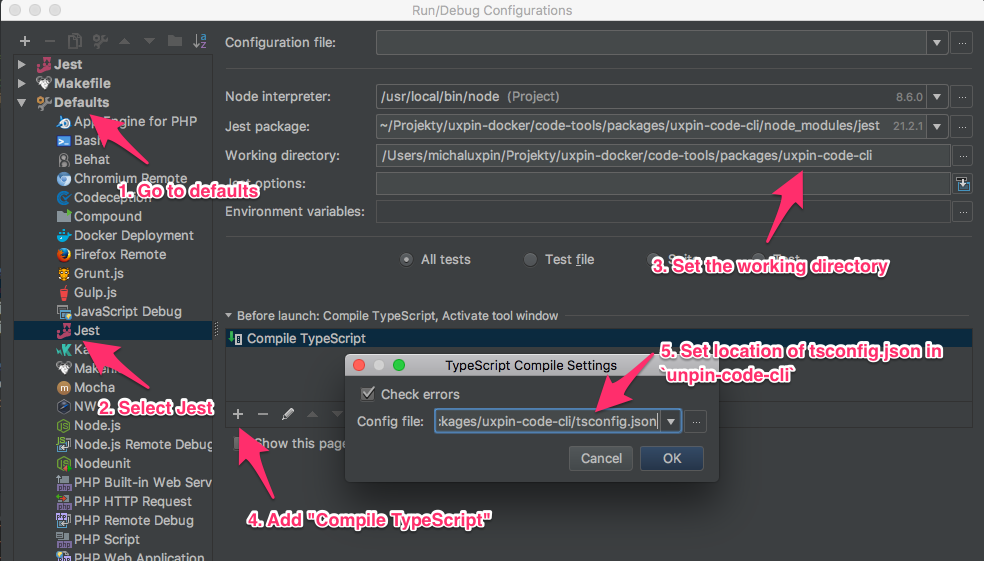

## How to run debug server for the example repo

Debug server is run for every example repository withing e2e tests located in `test/integration/server`, however sometimes it's useful to be able to run such server manually for debugging or tests authoring.

First of all go the the CLI package, and install dependencies:
```bash
cd packages/uxpin-code-cli/
yarn
make test-resources
```
then, build the project:
```bash
make build
```
and finally run the server in a directory of the example design system (Polaris in this case), providing all required config flags:
```bash
cd test/resources/repos/polaris/
../../../../bin/uxpin-code server --webpack-config "./playground/webpack.config"
```
Now wait for the console log claiming the server is ready, and open the given address in the browser:
```text
server started successfully!
server ready on http://127.0.0.1:8080/
```

## Jest Test setup for JetBrains IDE

### Run a particular test from code
JetBrains IDE allow beautifully run any test (or test suite) just from it's implementation by a single click:


To make it working you have to setup a default configuration of the Jest framework in "Run > Edit configurations..." the following way:


### Run only unit tests

To run unit (or integration) test separately from the other you can run `make test-unit` or `make test-integration` in console. The similar behaviour can be achieved using configuration of the Jest framework integration in the JetBrains IDE. Go to "Run > Edit Configurations...", add new Jest configuration and configure it as below:


Note the value in the "Jest options" field:
```
--testPathIgnorePatterns="/(test/integration|node_modules|test/resources)/"
```
To create a configuration running only integration tests, change the value of this field to the following value (excluding tests in the `spec` directory):
```
--testPathIgnorePatterns="/(src|node_modules|test/resources)/"
```
